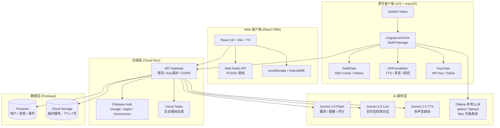
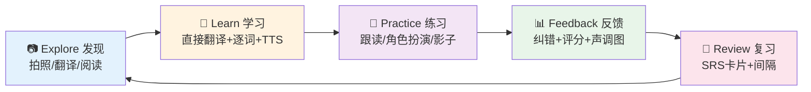

# LinguaLens 中文学习产品开发技术文档 v3.2
## 面向外国人的智能中文学习平台 · Web PWA + iOS + macOS 全平台整合版

> **产品愿景**：让全球学习者通过 AI 视觉识别、实时语音交互、沉浸式阅读与游戏化任务，在真实场景中轻松、有趣、高效地掌握中文。
>
> **文档说明**：本文档由多个原型项目的设计文档整合而成，为 LinguaLens 产品的唯一技术文档。

---

## 目录

1. [产品定位与核心价值](#1-产品定位与核心价值)
2. [翻译核心原则](#2-翻译核心原则)
3. [平台策略：三端并行](#3-平台策略三端并行)
4. [系统架构与技术栈](#4-系统架构与技术栈)
5. [核心功能模块全景](#5-核心功能模块全景)
6. [功能详解：学习闭环](#6-功能详解学习闭环)
   - 6.1 Translation Bridge（多语言翻译桥接器）
   - 6.2 Snap & Learn（拍照识物）
   - 6.3 Live Tutor（实时 AI 私教）
   - 6.4 Roleplay（情景对话模拟）
   - 6.5 Quest Hunt（任务寻宝游戏化）
   - 6.6 Fluency Coach（发音评估教练）
   - 6.7 Immersive Reader（沉浸式阅读）
   - 6.8 OmniReader TTS（多声音朗读器）
   - 6.9 SRS Review（间隔复习系统）
7. [辅助功能模块](#7-辅助功能模块)
   - 7.1 Tone Visualizer（声调可视化）
   - 7.2 Script Drafting（脚本起草）
   - 7.3 Shadowing（影子跟读）
   - 7.4 Pinyin Overlay（拼音标注）
   - 7.5 Cultural Decoder（文化解码器）
8. [用户体验与信息架构（三端）](#8-用户体验与信息架构三端)
9. [游戏化与激励系统](#9-游戏化与激励系统)
10. [技术实现细节](#10-技术实现细节)
11. [REST API 接口规范](#11-rest-api-接口规范)
12. [数据模型与存储架构](#12-数据模型与存储架构)
13. [离线 & 本地 AI 支持](#13-离线--本地-ai-支持)
14. [商业模式与变现策略](#14-商业模式与变现策略)
15. [数据与隐私架构](#15-数据与隐私架构)
16. [风险分析](#16-风险分析)
17. [验收标准](#17-验收标准)
18. [测试策略](#18-测试策略)
19. [开发路线图与分期计划](#19-开发路线图与分期计划)
20. [版本规划](#20-版本规划)

---

## 1. 产品定位与核心价值

### 1.1 产品定位

| 维度 | 描述 |
|------|------|
| **产品名称** | LinguaLens（语言透镜） |
| **核心理念** | "所见即所学，敢说就会，读以致用" — 将真实世界变成中文课堂 |
| **目标市场** | 全球中文学习者（重点：来华商务人士、旅行者、在华 expat） |
| **核心技术** | 多模型 AI 适配层 (Gemini / OpenAI / Anthropic) + 实时音视频 + 本地 LLM（离线） |
| **主要平台** | **Web PWA（React）+ iOS 原生（SwiftUI）+ macOS 原生（SwiftUI）** |
| **翻译策略** | 直接翻译优先，保留源文本到中文的完整映射关系 |

### 1.2 目标用户画像

```
                          ┌─────────┐
                          │  P0     │
                          │ 商务精英 │  ← 来华出差外企高管/销售
                        ┌─┴─────────┴─┐
                        │    P0       │
                        │  高端旅行   │  ← 自由行、文化体验游客
                      ┌─┴─────────────┴─┐
                      │      P1         │
                      │   外派驻华      │  ← 长期驻华工作人员
                    ┌─┴─────────────────┴─┐
                    │        P2           │
                    │   海外学习者        │  ← 大学生/语言爱好者
                    └─────────────────────┘
```

| 用户类型 | 典型场景 | 核心痛点 | 付费意愿 | 主要平台 |
|---------|---------|---------|---------|---------|
| **商务出差** 👔 | 会议、商务宴请、谈判 | 无法与本地客户沟通，商务礼仪陌生 | ⭐⭐⭐⭐⭐ 极高 | iPhone / Mac |
| **高端旅行** ✈️ | 自由行、美食、文化探索 | 点餐/问路/购物困难 | ⭐⭐⭐⭐ 高 | iPhone / Web |
| **外派驻华** 🏢 | 日常生活、职场社交 | 长期沟通障碍影响工作质量 | ⭐⭐⭐⭐⭐ 极高 | Mac + iPhone |
| **海外学习** 🎓 | 课外练习、HSK 备考 | 缺乏真实语境与即时反馈 | ⭐⭐⭐ 中 | Web / Mac / iPhone |

### 1.3 核心价值主张

| 传统/单一工具 | LinguaLens 整合解决方案 |
|-------------|----------------------|
| 翻译只给意译，看不出原文如何映射 | 🌉 **直接翻译 + 逐词对照** — 保留源文本映射，同时提供地道表达版 |
| 死记硬背单词卡 | 📸 **拍照即学** — 实物关联记忆，自然场景学习（Snap & Learn） |
| 发音无反馈 | 🎤 **AI 实时纠音 + 评分** — 声调可视化，0-100 分专业评测（Fluency Coach） |
| 缺乏语境 | 💬 **情景对话 + 沉浸阅读** — 商务/旅游情景 + 点词查意 |
| 学习枯燥 | 🎮 **游戏化激励** — 任务、徽章、连胜、XP/Level |
| 听力无练习 | 🔊 **多声音 TTS 朗读器** — 4 种 AI 声音，可控播放，影子跟读 |
| 复习遗忘 | 🧠 **SRS 间隔复习** — 智能卡片，遗忘曲线优化 |
| 无法离线 | 📴 **本地 LLM** — Ollama 支持，飞机/地铁可用（Mac） |

### 1.4 第一阶段范围（Phase 1 MVP）

**纳入第一阶段**

| 优先级 | 功能 |
|--------|------|
| P0 必须 | 翻译学习（多语言→中文）、拍照识物（Snap）、基础情景对话、SRS 复习 |
| P1 应有 | Fluency Coach 发音评估、沉浸式阅读、OmniReader TTS |
| P2 可选 | Shadowing 跟读、Script Drafting、Quest 游戏化 |

**第一阶段不纳入**

- 浏览器插件独立发布
- Android 客户端
- 社区、排行榜、UGC 内容生态
- 教师后台 / 企业管理后台
- 完整离线大模型端侧部署（iOS）
- 自定义角色扮演场景编辑器

---

## 2. 翻译核心原则

> ⚠️ 本章原则适用于所有平台（Web / iOS / macOS），是产品差异化的核心。

### 2.1 直接翻译优先原则

1. **默认输出直接翻译**，不只输出更自然的意译。
2. 所有翻译结果必须尽可能保留源文本到中文的映射关系。
3. 优先提供：完整中文句子 + 拼音 + 逐词/短语对应 + 语法说明。
4. 当自然表达与直接映射冲突时：
   - **主结果**：展示"直接翻译版"（chineseDirect）
   - **可选展开**：展示"地道表达版"（chineseNatural）
   - 两者必须明确区分，不允许偷换
5. 不允许模型擅自扩写、删减、礼貌化、文化替换，除非用户主动切换到"自然表达模式"。

### 2.2 翻译输出标准规格

```
输入: "I missed you so much" (任意语言均可)
     ↓ 语言自动检测
输出 A（直接翻译）: 我非常想念你 [DEFAULT]
输出 B（自然表达）: 我好想你（口语化）[OPTIONAL]
拼音: wǒ fēicháng xiǎngniàn nǐ
逐词: [我 wǒ I] [非常 fēicháng very] [想念 xiǎngniàn miss] [你 nǐ you]
用法说明: 书面/正式语气，口语可简化
文化注释: 中文情感表达常用程度副词强调
```

### 2.3 双语展示规则

| 区域 | 默认展示 | 展开后 |
|------|---------|--------|
| 翻译主结果 | 直接翻译中文 + 拼音 | 地道表达版 + 对比说明 |
| 逐词对照 | 中文词块 + 字面义 | 词性 + 例句 |
| AI 对话气泡 | 中文 + 小号英文字幕 | 点击显示拼音 / 慢速播放 |
| Coach 面板 | 中文 + 拼音 + 英文 | 一键复制/跟读 |
| 复习卡片 | 中文正面 / 英文+拼音背面 | 翻转动画 |

### 2.4 多语言输入支持

Translation Bridge 接受任意语言输入，AI 自动检测并翻译为地道中文：

| 语言 | 示例输入 | 直接翻译 | 地道表达 |
|------|---------|---------|---------|
| English | "I'm starving" | 我非常饥饿 | 我饿死了 |
| 日本語 | 「おはようございます」 | 早上好（您好）| 早上好 |
| Français | "Je suis désolé" | 我感到非常抱歉 | 对不起 |
| Español | "No entiendo" | 我不理解 | 我听不懂 |
| 한국어 | 배고파요 | 我饿了 | 我饿了 |
| Deutsch | "Entschuldigung" | 请原谅 / 打扰一下 | 对不起 |
| العربية | شكراً | 谢谢（感谢）| 谢谢 |

---

## 3. 平台策略：三端并行

### 3.1 三端定位

```
┌─────────────────────────────────────────────────────────────┐
│                    LinguaLens 三端矩阵                        │
├────────────────┬──────────────────┬────────────────────────┤
│  🌐 Web PWA    │   📱 iOS App      │   🖥 macOS App          │
│  React + Vite  │   SwiftUI + UIKit │   SwiftUI (native)     │
│  任何浏览器    │   iPhone / iPad   │   MacBook / iMac       │
│  快速试用入口  │   移动主力产品    │   深度学习工作站        │
├────────────────┴──────────────────┴────────────────────────┤
│                  Swift Package 共享核心逻辑（原生端）          │
│  LinguaLensCore:                                            │
│  • AIService（Gemini / Ollama）                             │
│  • TranslationEngine（直接翻译 + 逐词拆解）                  │
│  • PracticeHistoryStore（SRS + 收藏）                       │
│  • ExampleLibrary（例句库）                                  │
│  • TTSManager（AVFoundation + Gemini TTS）                  │
│  • LearningStore（XP / Quest / Profile）                    │
│  • PinyinEngine（声调标注）                                  │
└─────────────────────────────────────────────────────────────┘
```

### 3.2 三端能力矩阵

| 功能模块 | Web PWA | iOS | macOS | 备注 |
|---------|---------|-----|-------|------|
| **Translation Bridge** | ✅ 全功能 | ✅ 全功能 | ✅ 全功能 | 任意语言→中文 |
| **Snap & Learn** | ✅ Web Camera | ✅ 原生相机 | ✅ 摄像头+拖拽 | 核心功能 |
| **Live Tutor** | ✅ WebRTC | ✅ | ✅ | Gemini Live API |
| **Roleplay** | ✅ | ✅ | ✅ | 麦克风+扬声器 |
| **Fluency Coach** | ✅ | ✅ | ✅ | 录音评分 |
| **Immersive Reader** | ✅ | ✅ 手势选词 | ✅ 双栏精读 | 手势/点击选词 |
| **OmniReader TTS** | ✅ 4声音 | ✅ 4声音 | ✅ 4声音 | Gemini TTS |
| **SRS Review** | ✅ localStorage | ✅ SwiftData | ✅ SwiftData | 跨端同步 |
| **Shadowing** | ✅ | ✅ | ✅ | 跟读练习 |
| **Script Drafting** | ✅ | ✅ | ✅ | 脚本起草 |
| **Quest Hunt** | ✅ | ✅ | ✅ | 相机触发 |
| **Pinyin Overlay** | 🔌 扩展插件 | 🔌 Safari 扩展 | 🔌 Safari 扩展 | 跨平台扩展 |
| **Ollama 本地 LLM** | ❌ | ❌ | ✅ 专属 | 离线翻译/对话 |
| **直接翻译模式** | ✅ | ✅ | ✅ | 全平台一致 |
| **BYOK API Key** | ✅ localStorage | ✅ Keychain | ✅ Keychain | Gemini / OpenAI / Anthropic 三方密钥，按功能路由 |

### 3.3 平台差异化设计

| 维度 | Web PWA | iOS | macOS |
|------|---------|-----|-------|
| **主导航** | 底部 Tab Bar | Tab Bar | Sidebar + Detail |
| **拍照** | `<input capture>` | AVCaptureSession | 摄像头 + 图片拖拽 |
| **输入辅助** | 标准键盘 | 键盘工具条扩展 | 悬浮面板 / 快捷键 |
| **分享导入** | Web Share API | Share Extension | Share Extension + 拖拽 |
| **本地存储** | localStorage / IndexedDB | SwiftData + Keychain | SwiftData + Keychain |
| **多窗口** | 单页 | NavigationStack | 多窗口 + Split View |
| **可访问性** | ARIA | VoiceOver + Dynamic Type | VoiceOver + 键盘导航 |
| **离线 AI** | ❌ | ❌ | ✅ Ollama |

---

## 4. 系统架构与技术栈

### 4.1 整体架构图



### 4.2 技术栈选型

#### Web 端（当前已实现）

| 层级 | 技术 | 版本 | 说明 |
|------|------|------|------|
| **前端框架** | React | 18.x | 组件复用，Hooks |
| **构建工具** | Vite | 5.x | 极速开发，ESM |
| **类型系统** | TypeScript | 5.x | 减少运行时错误 |
| **样式** | Tailwind CSS | 3.x | 原子化 CSS |
| **AI SDK** | @google/genai | 0.7.x | Gemini 官方 SDK |
| **AI 适配层** | 自研 aiProvider.ts | - | 统一抽象 OpenAI / Anthropic (fetch) |
| **音频** | Web Audio API | - | PCM16 实时处理 |
| **状态** | React Hooks + localStorage | - | 轻量本地状态 |
| **路由** | 单页 Tab 切换 | - | 无路由库依赖 |

#### 原生端（iOS + macOS）

| 层级 | 技术 | 版本 | 说明 |
|------|------|------|------|
| **UI 框架** | SwiftUI | iOS 17+ / macOS 14+ | 跨 Mac/iOS 声明式 UI |
| **共享逻辑** | Swift Package Manager | - | LinguaLensCore 模块化 |
| **本地存储** | SwiftData | iOS 17+ | SRS 卡片 / 历史 |
| **敏感存储** | Keychain | - | API Key / 登录 Token |
| **音频** | AVFoundation | - | TTS / 录音 / 播放 |
| **相机** | AVCaptureSession + VisionKit | - | 实时取景 + 静态拍照 |
| **OCR** | Vision Framework | - | 文字识别辅助 |
| **网络** | URLSession (async/await) | - | 原生异步网络 |
| **AI（云）** | Gemini Swift SDK | latest | 官方 Swift SDK |
| **AI（本地）** | Ollama HTTP API | - | Mac 本地 LLM 推理 |
| **认证** | Firebase Auth SDK | - | Google/Apple OAuth |
| **分词** | NaturalLanguage + 词典 | iOS 16+ | 中文分词 |
| **拼音** | 本地词典 + 多音字处理 | - | 声调准确标注 |

#### 后端（共用）

| 层级 | 技术 | 说明 |
|------|------|------|
| **运行时** | Cloud Run (Node.js 20) | Serverless，按需扩容 |
| **网关** | Cloud Load Balancer | 多区域（HK/EU/US）|
| **队列** | Cloud Tasks + BullMQ | 异步媒体处理 |
| **密钥** | Secret Manager | 所有 Key 后端持有 |
| **监控** | Cloud Monitoring | 成本/延迟/错误率告警 |
| **日志** | Cloud Logging | 结构化请求日志 |

### 4.3 多 AI 厂商适配层

#### 4.3.1 路由策略

| 功能 | 支持的 Provider | 默认 | 备注 |
|------|---------------|------|------|
| 翻译 / 分析 / 生成 | Gemini ✅ · OpenAI ✅ · Anthropic ✅ | 用户配置 | 静态文字功能 |
| 图像识别（Snap） | Gemini ✅ · OpenAI ✅ · Anthropic ✅ | 用户配置 | 多模态视觉 |
| TTS 朗读 | Gemini ✅ | Gemini Only | 依赖 Gemini TTS API |
| Live Tutor 实时对话 | Gemini ✅ | Gemini Only | 依赖 Gemini Live API |
| 发音评估 | Gemini ✅ | Gemini Only | 依赖 Gemini 音频输入 |

#### 4.3.2 推荐模型清单（2025）

| 厂商 | 模型 ID | 推荐场景 | 价格等级 |
|------|---------|---------|---------|
| **Google Gemini** | `gemini-2.5-flash` | 静态分析（默认推荐 ⭐） | 💰 低 |
| **Google Gemini** | `gemini-2.5-pro` | 复杂推理、高质量翻译 | 💰💰💰 高 |
| **Google Gemini** | `gemini-2.0-flash` | 快速响应、低延迟 | 💰 低 |
| **OpenAI** | `gpt-4.1-mini` | 性价比最优 ⭐ | 💰 低 |
| **OpenAI** | `gpt-4.1` | 高质量分析 | 💰💰💰 高 |
| **OpenAI** | `gpt-4o` | 均衡多模态 | 💰💰 中 |
| **OpenAI** | `gpt-4o-mini` | 预算优先 | 💰 最低 |
| **Anthropic** | `claude-sonnet-4-6` | 长文分析最优 ⭐ | 💰💰 中 |
| **Anthropic** | `claude-opus-4-6` | 最高智能 | 💰💰💰💰 极高 |
| **Anthropic** | `claude-haiku-4-5-20251001` | 极速轻量 | 💰 最低 |

> **获取 API Key 地址：**
> - Gemini: https://aistudio.google.com/apikey （免费额度）
> - OpenAI: https://platform.openai.com/api-keys
> - Anthropic: https://console.anthropic.com/

#### 4.3.3 适配层技术方案

```typescript
// src/services/aiProvider.ts
interface GenerateOptions {
  jsonMode?: boolean;
  geminiSchema?: object;   // Gemini 原生 Schema 强类型
  imageBase64?: string;    // 多模态图像输入
  imageMimeType?: string;
  temperature?: number;
}

export async function generateText(
  prompt: string,
  options?: GenerateOptions
): Promise<string>
// 根据 SettingsStore.getProvider() 自动路由至 Gemini / OpenAI / Anthropic
```

**各 Provider JSON 模式：**
- **Gemini**: `responseMimeType: 'application/json'` + `responseSchema`（强类型）
- **OpenAI**: `response_format: { type: 'json_object' }` + 系统提示声明
- **Anthropic**: `system: '...only respond with valid JSON'` + 提示工程

### 4.4 共享包结构（原生端）

```
LinguaLens/
 ├── Apps/
 │   ├── LinguaLensiOS/        # iOS App Target
 │   └── LinguaLensMac/        # macOS App Target
 └── Packages/
     ├── LinguaLensCore/       # 实体模型、协议、配置、日志
     ├── LinguaLensAI/         # 翻译引擎、识图、对话、TTS、评分
     ├── LinguaLensNetworking/ # API Client、鉴权、重试、缓存
     ├── LinguaLensFeatures/   # Translate、Camera、Roleplay、Reader、Review
     └── LinguaLensUI/         # 设计系统、通用组件、主题
```

---

## 5. 核心功能模块全景

### 5.1 功能矩阵总览

| 模块 | 用户价值 | 输入 | 输出 | 优先级 | Web | iOS | macOS |
|------|---------|------|------|-------|-----|-----|-------|
| **Translation Bridge** | 任意语言→地道中文 | 任意文本 | 直译+逐词+拼音+文化 | P0 | ✅ | ✅ | ✅ |
| **Snap & Learn** | 看到就学，零门槛 | 照片 | 词条+拼音+例句+文化 | P0 | ✅ | ✅ | ✅ |
| **Live Tutor** | 实时 AI 私教 | 音频+视频帧 | 实时语音回复 | P0 | ✅ | ✅ | ✅ |
| **Roleplay** | 情景对话实战 | 场景+语音 | 对话+纠错+总结 | P0 | ✅ | ✅ | ✅ |
| **Quest Hunt** | 学习游戏化 | 任务+照片 | 判定+奖励+XP | P0 | ✅ | ✅ | ✅ |
| **Fluency Coach** | 发音专项评估 | 录音+材料 | 评分+反馈+音调分析 | P0 | ✅ | ✅ | ✅ |
| **Immersive Reader** | 沉浸阅读+点词查词 | 中文文本 | 词义+语法+朗读 | P1 | ✅ | ✅ | ✅ |
| **OmniReader TTS** | 多声音 AI 朗读 | 任意文本 | 音频流+播放器 | P1 | ✅ | ✅ | ✅ |
| **SRS Review** | 间隔复习记忆 | 学习记录 | 复习卡+评分 | P1 | ✅ | ✅ | ✅ |
| **Shadowing** | 影子跟读练习 | 主题选择 | 朗读材料+播放 | P2 | ✅ | ✅ | ✅ |
| **Script Drafting** | 口语脚本起草 | 草稿文本 | AI 精炼+语法点 | P2 | ✅ | ✅ | ✅ |
| **Tone Visualizer** | 声调曲线可视化 | 用户音频 | 音高曲线+评分 | P2 | ✅ | ✅ | ✅ |
| **Pinyin Overlay** | 实时拼音注释 | 中文文本 | 拼音+翻译标注 | P2 | 🔌 | 🔌 | 🔌 |
| **Ollama 本地 LLM** | 离线 AI 能力 | 文本输入 | 翻译/对话 | P2 | ❌ | ❌ | ✅ |
| **Cultural Decoder** | 文化梗解析 | 链接/截图/文字 | 文化背景讲解 | P3 | 计划 | 计划 | 计划 |

### 5.2 学习闭环流程



---

## 6. 功能详解：学习闭环

### 6.1 Translation Bridge（多语言翻译桥接器）

**来源**：lingobridge-chinese + chinese-learning-app + 统一翻译原则

**核心能力**：任意语言输入 → 直接翻译中文 + 地道表达版 + 逐词对照 + 拼音 + 文化注释 + TTS 朗读

**数据模型（跨平台统一）**

```typescript
// Web / TypeScript
interface TranslationResult {
  original: string;              // 原文（任意语言）
  detectedLanguage: string;      // 检测到的语言，如 "French"
  chineseDirect: string;         // 直接翻译版："我非常想念你"
  chineseNatural?: string;       // 地道表达版："我好想你"（可选展示）
  pinyin: string;                // "wǒ fēicháng xiǎngniàn nǐ"
  breakdown: WordBreakdown[];    // 逐词对照
  usageNote?: string;            // 使用场合说明
  culturalNote?: string;         // 文化注释
}

interface WordBreakdown {
  chinese: string;   // "想念"
  pinyin: string;    // "xiǎngniàn"
  literal: string;   // "miss / long for"
  pos?: string;      // "verb"
}
```

```swift
// iOS / macOS / Swift
struct TranslationResult: Codable, Identifiable {
    let id: UUID
    let sourceText: String
    let detectedLanguage: String
    let chineseDirect: String         // 直接翻译（必须）
    let chineseNatural: String?       // 地道表达（可选展示）
    let pinyin: String
    let segments: [TranslationSegment]
    let usageNote: String?
    let culturalNote: String?
    let createdAt: Date
}

struct TranslationSegment: Codable, Identifiable {
    let id: UUID
    let chinese: String
    let pinyin: String
    let literal: String               // 字面义
    let partOfSpeech: String?
}
```

**功能清单**

- ✅ 任意语言输入，AI 自动检测语种
- ✅ 默认展示"直接翻译版"，可展开"地道表达版"
- ✅ 逐字/逐词对照标签展示（GlossTag）
- ✅ 文化注释与使用场合说明
- ✅ 历史记录（最近 20 条，含语言标签）
- ✅ 一键 TTS 朗读中文翻译
- ✅ 收藏翻译到词汇本
- ✅ 显示检测语言徽标（如 "Detected: Japanese"）

**界面原型（三端一致）**
```
┌────────────────────────────┐
│ Translation Bridge         │
├────────────────────────────┤
│  Any Language → Chinese    │
│  ┌──────────────────────┐  │
│  │ Je t'aime beaucoup   │  │
│  └──────────────────────┘  │
│    🌐 Detected: French     │
│         [ 翻译 → ]         │
├────────────────────────────┤
│  【直接翻译】              │
│  我非常爱你  wǒ fēicháng ài nǐ│
│             🔊 [ 播放 ]    │
│  ──────────────────────    │
│  [展开] 地道表达: 我好爱你  │
│  ──────────────────────    │
│  逐词对照:                  │
│  [我 wǒ I] [非常 very]     │
│  [爱 ài love] [你 nǐ you]  │
│  ──────────────────────    │
│  💬 书面语，正式感强         │
│  🌍 中文常用程度副词强调情感 │
├────────────────────────────┤
│ [ ➕ 加词库 ] [ 📋 历史 ]  │
└────────────────────────────┘
```

---

### 6.2 Snap & Learn（拍照识物学习）

**核心流程**
```
用户拍照 → Gemini Flash 分析 → 结构化 JSON → 学习卡片 → TTS 播放/跟读 → 加入词汇本
```

**完整数据 Schema**
```typescript
interface SnapAnalysis {
  chinese: string;          // "苹果"
  pinyin: string;           // "píng guǒ"
  english: string;          // "apple"
  sentence: string;         // "这个苹果很甜。"
  sentencePinyin: string;   // "zhè ge píng guǒ hěn tián"
  sentenceEnglish: string;  // "This apple is very sweet." (直接翻译)
  hskLevel?: number;        // 2
  radicals?: string[];      // ["艹", "平", "果"]
  funFact?: string;         // "苹果在中国象征平安"
  commonMistake?: string;   // "不要把 píng 读成 pín"
  usageNote?: string;
  culturalNote?: string;
}
```

**iOS 界面原型**
```
┌────────────────────────────┐
│ ← Snap & Learn    [相机图标]│
├────────────────────────────┤
│  [摄像头取景框 / 上传图片]  │
│        [ 📷 拍照 ]          │
├────────────────────────────┤
│  苹果  píng guǒ  🔊        │
│  apple          HSK 2      │
│  这个苹果很甜。              │
│  zhè ge píng guǒ hěn tián  │
│  "This apple is very sweet"│
│  🎭 Fun: 苹果象征"平安"     │
│  ⚠️ 别把 píng 读成 pín      │
│  部首: 艹 · 平 · 果         │
├────────────────────────────┤
│  [ 🎤 跟读 ]  [ ➕ 加入词库]│
└────────────────────────────┘
```

---

### 6.3 Live Tutor（实时 AI 私教）

**核心能力**：摄像头 + 麦克风实时传输 → Gemini Live API → 双向语音对话 + 视觉上下文

**会话模式**

| 模式 | 描述 | 适用场景 |
|------|------|---------|
| **自由对话** | 无场景约束，AI 随机应变 | 日常练习、词汇扩展 |
| **场景引导** | 绑定 Roleplay 场景 | 针对性情景训练 |
| **纠错模式** | AI 专注纠正发音和语法 | 备考 HSK |

**技术参数**

| 参数 | 值 | 目的 |
|------|-----|------|
| 视频采样率 | 1 FPS | 节省带宽 80%+ |
| 图像缩放 | 50% 原尺寸 | 降低 CPU 占用 |
| JPEG 质量 | 0.6（Live）| 平衡质量与体积 |
| 音频上行 | PCM16 / 16kHz | Gemini Live 要求 |
| 音频下行 | PCM16 / 24kHz | 高质量输出 |

---

### 6.4 Roleplay（情景对话模拟器）

**9 大核心场景**

| 场景 | 学习目标 | 关键短语 | HSK |
|------|---------|---------|-----|
| 点咖啡 ☕ | 礼貌点单 | 我要/一杯/少糖 | 1-2 |
| 打车 🚖 | 目的地表达 | 去/到/多少钱 | 1-2 |
| 餐厅点菜 🍜 | 口味偏好 | 不要/辣/推荐 | 2 |
| 超市结账 🛒 | 数字与量词 | 这个/一共/支付宝 | 2 |
| 约时间 📅 | 时间表达 | 明天/下午/可以吗 | 2-3 |
| 看病挂号 🏥 | 身体部位 | 哪里不舒服/疼 | 3 |
| 同事寒暄 💼 | 社交小聊 | 最近/怎么样/周末 | 3 |
| 商务会议 📊 | 职场常用句 | 先介绍/然后/总结 | 3-4 |
| 夜市讨价 🏮 | 讨价还价 | 太贵了/便宜一点 | 2-3 |

**AI Coach 介入逻辑**

```
Soft Coaching（默认）:
  • AI 保持角色，不中断对话
  • 侧边栏/底部实时显示纠错提示
  • 连续 3 次重复错误 → 温柔语音打断

Cheat Mode（渐进式降级）:
  连续3次全句失败 → 降级到单音节练习
  单音节通过3次   → 升级到词组练习
  词组通过5次     → 回到全句对话
```

**结构化输出 Schema**
```typescript
interface RoleplayTurn {
  scenarioId: string;
  assistantText: { zh: string; en: string; };
  keyPhrases: Array<{ zh: string; pinyin: string; en: string; }>;
  corrections: Array<{
    type: 'tone' | 'grammar' | 'vocab';
    zh: string;
    en: string;
    severity: 'low' | 'medium' | 'high';
  }>;
  nextPrompt?: { zh: string; en: string };
  sessionSummary?: { zh: string; en: string; learnedItems: string[] };
}
```

---

### 6.5 Quest Hunt（任务寻宝游戏化）

**任务类型**

| 类型 | 示例 | 完成条件 | XP |
|------|------|---------|-----|
| Snap Quest | "找到一个红色物体" | Snap 识别 + 颜色判定 | 50 |
| Live Quest | "开始一次 Live 对话" | 建立连接 | 30 |
| Roleplay Quest | "完成点咖啡场景" | 场景结束 | 80 |
| Translation Quest | "翻译 5 个句子" | 计数达标 | 40 |
| Review Quest | "复习 10 张卡片" | SRS 评分完成 | 20 |

---

### 6.6 Fluency Coach（发音评估教练）

**功能流程**
```
选择等级+话题 → AI 生成练习材料 → 用户录音 → Gemini 评分 → 声调分析 + 改进建议
```

**评估维度**
- 总分（0-100）
- 声调准确率（逐字分析）
- 流利度（停顿/语速）
- 发音建议（3-5 条针对性改进）

---

### 6.7 Immersive Reader（沉浸式阅读）

**功能清单**
- AI 清洗杂乱文本（去除导航/广告）
- 点击词块查看：拼音 + 字面义 + 词性 + 例句
- 句子语法拆解（主谓宾结构标注）
- 全文朗读（OmniReader 联动）
- 生词加入 SRS 复习
- 四种阅读模式：标准 / 行间注音 / 音频 / 逐段提问

**阅读模式**

| 模式 | 说明 | 平台 |
|------|------|------|
| Reader | 标准阅读，点词查义 | 全平台 |
| Annotated | 行间拼音 + 词义 | 全平台 |
| Audio | 朗读播放器 | 全平台 |
| Drill | 每段读后提问/跟读 | 全平台 |

---

### 6.8 OmniReader TTS（多声音 AI 朗读器）

**声音选择**（Gemini 2.5 TTS）

| 声音 | 风格 | 适用 |
|------|------|------|
| Zephyr | 清晰标准 | 学习朗读 |
| Kore | 温柔女声 | 日常练习 |
| Fenrir | 沉稳男声 | 商务/正式 |
| Puck | 活泼年轻 | 对话练习 |

---

### 6.9 SRS Review（间隔复习系统）

**SM-2 算法参数**

| 评分 | 间隔增长 | 意义 |
|------|---------|------|
| Again | 重置为 1 天 | 完全遗忘 |
| Hard | × 1.2 | 勉强记住 |
| Good | × easeFactor (≈2.5) | 正常掌握 |
| Easy | × easeFactor × 1.3 | 轻松掌握 |

**默认间隔序列**：1天 → 3天 → 7天 → 14天 → 30天

**词汇卡片数据模型**
```typescript
interface VocabCard {
  id: string;
  chinese: string;
  pinyin: string;
  english: string;
  chineseDirect?: string;    // 关联的直接翻译
  exampleSentence: string;
  hskLevel: number;
  interval: number;
  easeFactor: number;        // 初始 2.5
  nextReviewDate: string;
  reviewCount: number;
  isFavorite: boolean;
  sourceModule: 'snap' | 'roleplay' | 'reader' | 'translation' | 'fluency';
}
```

---

## 7. 辅助功能模块

### 7.1 Tone Visualizer（声调可视化）

**输入**：用户录音（麦克风）
**输出**：音高曲线对比图 + 0-100 分 + 针对性建议

**分阶段实现**

| 阶段 | 方法 |
|------|------|
| v1 | 粗分类（升/降/平/曲） |
| v2 | DTW 动态时间规整对齐 |
| v3 | 第三方专业测评 API |

### 7.2 Script Drafting（脚本起草）

**场景**：出行前准备 → 写下想说的话（任意语言草稿）→ AI 转化为地道中文并解释

```
输入: "I am engineer. Work 5 year. Like technology." (任意语言)
↓ AI 精炼（遵循直接翻译原则）
直接翻译: 我是工程师。工作五年。喜欢技术。
地道表达: 我是一名工程师，已有五年工作经验，对技术很感兴趣。
拼音: Wǒ shì yī míng gōng chéng shī...
要点: ① "已有...经验" 比直接说数字更自然
      ② 可加 "很高兴认识您" 开场
```

### 7.3 Shadowing（影子跟读）

- 按主题生成带停顿标注的跟读材料
- OmniReader TTS 朗读（可调速度 0.5x - 1.5x）
- 用户跟读后 Fluency Coach 评分
- 停顿标注格式：`你好，/ 我叫张伟。/ 很高兴认识你。//`

### 7.4 Pinyin Overlay（拼音标注）

**Safari App Extension（Mac + iOS）**
- 网页任意中文文本上叠加拼音（Ruby 标注格式）
- 可选：只显示拼音 / 只显示翻译 / 二者皆显
- 翻译结果缓存（500 条，LRU）

### 7.5 Cultural Decoder（文化解码器）

**功能**：输入链接/截图/文字 → AI 解析文化背景、历史典故、网络梗

**场景示例**：
- "666 在中文里是什么意思？" → 厉害、很好，来自游戏文化
- "为什么吃饭时不能把筷子插饭上？" → 祭祀含义，礼仪禁忌

---

## 8. 用户体验与信息架构（三端）

### 8.1 iOS Tab Bar 架构

```
📱 iOS App
├── 🏠 首页 (Home)
│   ├── Quest Dashboard（今日任务 + XP）
│   ├── 快捷入口：Snap / 翻译 / 复习 / 阅读
│   └── 学习连胜 Streak
├── 🌉 学习 (Learn)
│   ├── Translation Bridge（多语言→中文）
│   ├── Snap & Learn（拍照识物）
│   ├── OmniReader TTS（朗读器）
│   └── Multi-Source（YouTube/PDF）
├── 🎤 练习 (Practice)
│   ├── Live Tutor（实时私教）
│   ├── Roleplay（情景对话 × 9场景）
│   ├── Fluency Coach（发音评估）
│   └── Shadowing（影子跟读）
├── 📖 阅读 (Read)
│   ├── Immersive Reader（沉浸阅读）
│   ├── Script Drafting（脚本起草）
│   └── Cultural Decoder（文化解码）
└── 👤 我的 (Profile)
    ├── 学习统计（XP/Level/连胜）
    ├── 词汇本 + SRS 复习
    ├── 历史记录与收藏夹
    ├── 成就徽章
    └── 设置（API Key / 订阅 / 隐私）
```

### 8.2 macOS 侧边栏架构

```
🖥 macOS App（Sidebar + Detail 双栏）
├── 首页 Dashboard
├── Translation Bridge    [左: 输入 | 右: 直译+逐词+地道版]
├── Snap & Learn          [左: 取景/拖拽 | 右: 词条卡片]
├── Immersive Reader      [左: 文本 | 右: 词义面板]
├── Fluency Coach         [大屏友好评分界面]
├── Roleplay              [左: Coach面板 | 右: 对话界面]
├── OmniReader TTS        [Podcast 风格播放器]
├── SRS 复习              [卡片 + 统计图]
└── 设置
    ├── 本地 AI（Ollama 管理）
    ├── API Key 配置（BYOK）
    └── 订阅管理
```

### 8.3 Web PWA 架构

```
🌐 Web App（底部 Tab Bar）
├── 🏠 首页：Quest Dashboard
├── 📷 Snap：相机/上传识物
├── 🎤 Practice：Live / Roleplay / Fluency
├── 📚 Learn：Translation / Reader / OmniReader / Shadowing / Script
├── 🔄 Review：SRS 复习
├── 👤 Profile：统计 + 成就
└── ⚙️ Settings：API Key + 模型 + 订阅计划
```

### 8.4 交互原则

1. **结果必须先快后全** — 先展示主答案，再逐步展开细节
2. **常见操作单击直达** — 朗读、收藏、加入复习、复制
3. **平台适配** — iOS 优先单手可达；macOS 优先多栏并行查看
4. **直接翻译优先** — 翻译结果默认展示直接翻译，地道版展开可选
5. **错误降级友好** — 网络失败时展示文字版，API Key 缺失时引导配置页

---

## 9. 游戏化与激励系统

### 9.1 XP 获取规则

| 行为 | XP 奖励 |
|------|---------|
| 完成 Snap & Learn | +5 XP |
| 翻译并保存到词库 | +3 XP |
| Roleplay 完成一轮对话 | +10 XP/分钟 |
| Fluency Coach 评分 ≥ 80 | +20 XP |
| Quest 任务完成 | +50~100 XP |
| SRS 卡片复习 | +2 XP/张 |
| 连续打卡加成 | ×1.5（7 天）/ ×2.0（30 天） |

### 9.2 Level 系统

```
Level = Math.floor(totalXP / 200) + 1

Level 1  (0 XP)      → 初学者 Beginner
Level 5  (800 XP)    → 入门 Elementary
Level 10 (1800 XP)   → 初级 HSK 2
Level 20 (3800 XP)   → 中级 HSK 4
Level 30 (5800 XP)   → 高级 HSK 6
```

### 9.3 徽章系统

| 徽章 | 触发条件 |
|------|---------|
| 🏅 Red Master | 找到红色物体 Quest |
| 🎤 发音达人 | Fluency Coach 评分 ≥ 90 连续 3 次 |
| 🔥 连胜 7 天 | 连续打卡 7 天 |
| ☕ 咖啡达人 | 完成"点咖啡"场景 5 次 |
| 📚 阅读王 | Immersive Reader 阅读 10 篇 |
| 🌉 翻译大师 | 翻译 50 个句子并保存到词库 |

---

## 10. 技术实现细节

### 10.1 音频处理管线

#### Web 端（PCM16 管线）

**上行（用户 → Gemini）**
```
麦克风 MediaStream (16kHz)
   ↓ AudioContext + ScriptProcessorNode (4096 buffer)
   ↓ Float32Array → Int16Array (PCM16)
   ↓ Base64 Encoding
   ↓ session.sendRealtimeInput({ media: { mimeType:'audio/pcm;rate=16000', data } })
```

**下行（Gemini → 扬声器）**
```
onmessage(Base64 PCM16, 24kHz)
   ↓ Base64 Decode → Int16Array → Float32Array
   ↓ AudioContext.createBuffer(1, length, 24000)
   ↓ BufferSourceNode.start(nextStartTime)  // 预调度防爆音
   ↓ 扬声器输出
```

**关键工具函数**
```typescript
function float32ToPCM16(float32: Float32Array): Uint8Array {
  const int16 = new Int16Array(float32.length);
  for (let i = 0; i < float32.length; i++) {
    const s = Math.max(-1, Math.min(1, float32[i]));
    int16[i] = s < 0 ? s * 0x8000 : s * 0x7FFF;
  }
  return new Uint8Array(int16.buffer);
}

function base64ToFloat32Array(base64: string): Float32Array {
  const bytes = new Uint8Array(atob(base64).split('').map(c => c.charCodeAt(0)));
  const int16 = new Int16Array(bytes.buffer);
  const float32 = new Float32Array(int16.length);
  for (let i = 0; i < int16.length; i++) {
    float32[i] = int16[i] / 32768.0;
  }
  return float32;
}
```

#### Swift 端（AVFoundation 管线）

```swift
class TTSManager {
    private let synthesizer = AVSpeechSynthesizer()

    // 本地 TTS（离线）
    func speakChinese(_ text: String, rate: Float = 0.45) {
        let utterance = AVSpeechUtterance(string: text)
        utterance.voice = AVSpeechSynthesisVoice(language: "zh-CN")
        utterance.rate = rate
        synthesizer.speak(utterance)
    }

    // 云端 TTS（Gemini，高质量）
    func speakWithGemini(_ text: String, voice: VoiceName) async throws -> Data {
        // POST /api/tts → 返回 base64 PCM → AVAudioPlayer
    }
}
```

### 10.2 中文分词与拼音引擎

**Swift 实现**
```swift
// 方案A: 系统 NLP（iOS 16+）
import NaturalLanguage
func tokenize(_ text: String) -> [String] {
    let tokenizer = NLTokenizer(unit: .word)
    tokenizer.string = text
    var tokens: [String] = []
    tokenizer.enumerateTokens(in: text.startIndex..<text.endIndex) { range, _ in
        tokens.append(String(text[range]))
        return true
    }
    return tokens
}

// 拼音引擎（本地词典，考虑多音字上下文）
struct PinyinEngine {
    static func pinyin(for word: String) -> String
    static func pinyin(for character: Character, context: String) -> String
}
```

**Web 端**
```typescript
// Gemini 直接返回拼音（当前实现）
// 后期可集成 pinyin-pro 本地库
import { pinyin } from 'pinyin-pro';
const result = pinyin('苹果', { toneType: 'symbol' }); // "píng guǒ"
```

### 10.3 AI 模型调用策略

#### 多 Provider 路由（Web 已实现）

| 功能 | 支持 Provider | 路由方式 | 备用链路（Mac） |
|------|-------------|---------|--------------|
| 翻译 + 逐词分析 | Gemini ✅ · OpenAI ✅ · Anthropic ✅ | `aiProvider.ts` 按用户设置路由 | Ollama qwen2:7b |
| 图像分析（Snap）| Gemini ✅ · OpenAI ✅ · Anthropic ✅ | 多模态视觉，三方均支持 | ❌ 无备用 |
| 语法/词汇分析 | Gemini ✅ · OpenAI ✅ · Anthropic ✅ | `aiProvider.ts` | Ollama qwen2:7b |
| TTS 朗读 | **Gemini Only** | `getGeminiAI()` 直接调用 | AVSpeechSynthesizer |
| 实时对话（Live）| **Gemini Only** | Gemini Live API，无法替换 | ❌ 无备用 |
| 发音评分 | **Gemini Only** | 依赖 Gemini 音频输入能力 | ❌ 无备用 |

> **注意**：TTS / Live Tutor / 发音评估 始终使用 Gemini（`getGeminiAI()`），即使用户将主 Provider 切换为 OpenAI/Anthropic，这三项功能仍需单独配置 Gemini API Key。

### 10.4 Web PWA / iOS 兼容性实现

> 以下为 Web 端已实现的跨平台兼容措施，确保在 iPhone Safari、macOS Safari、Chrome 等环境一致运行。

| 类别 | 问题 | 解决方案 | 实现位置 |
|------|------|---------|---------|
| **安全区域** | iPhone 刘海/动态岛/Home Bar 遮挡内容 | `viewport-fit=cover` + `env(safe-area-inset-*)` | `index.html` + `Navigation.tsx` |
| **PWA 元标签** | 无法添加到 iOS 主屏幕 | `apple-mobile-web-app-capable` + `theme-color` | `index.html` |
| **触控响应** | 按钮点击 300ms 延迟 | `touch-action: manipulation` 全局样式 | `index.html` CSS |
| **输入缩放** | iOS 自动放大小字号 input | 全局 `input/textarea/select { font-size: 16px }` | `index.html` CSS |
| **Retina 画布** | ToneVisualizer 在高分辨率下模糊 | `canvas.width/height × devicePixelRatio` + `ctx.scale(dpr, dpr)` | `ToneVisualizer.tsx` |
| **AudioContext** | Safari/iOS 需用户手势后才能播放音频 | 初始化时调用 `audioCtx.resume()` | `ToneVisualizer.tsx` |
| **触控目标** | 移动端底部 Tab 按钮过小（<44px） | `min-w-[44px] min-h-[44px]` 保证最小触控面积 | `Navigation.tsx` |
| **中文字体** | Noto Serif SC（衬线）不适合学习场景 | 改用 `Noto Sans SC`（无衬线）+ Google Fonts 预加载 | `tailwind.config.js` + `index.html` |
| **录音验证** | 用户录制时间过短导致 AI 评分失败 | Blob size < 1KB 时提示重录，拦截无效提交 | `AudioRecorder.tsx` |

### 10.5 API Key 访问控制（三端一致）

```
用户访问 AI 功能
    ↓
检查当前 Provider (SettingsStore.getProvider())
    ↓
检查对应 API Key (localStorage / Keychain)
    ├─ 有效 Key → 直接调用对应 Provider API（BYOK）
    │               Gemini: @google/genai SDK
    │               OpenAI: fetch → api.openai.com
    │               Anthropic: fetch → api.anthropic.com (含 dangerous-direct-browser-access header)
    └─ 无 Key → 检查订阅状态
                    ├─ 有效订阅 → 经后端代理调用（配额管理）
                    └─ 无订阅 → 展示 ApiGate（付费墙）
                                    ├─ [配置 API Key] → Settings
                                    └─ [查看订阅计划] → Pricing

特殊路由（无论主 Provider 如何设置）：
    TTS / Live Tutor / 发音评估 → 始终走 Gemini Key
```

**BYOK 存储方式**

| 平台 | 存储位置 | 安全级别 |
|------|---------|---------|
| Web | localStorage（明文）| 普通，同源 JS 可读 |
| iOS | Keychain（加密）| 高，系统级保护 |
| macOS | Keychain（加密）| 高，系统级保护 |

**Web 端 localStorage Key 命名**

| Key | 内容 |
|-----|------|
| `lingualens_settings` | provider / apiKey(Gemini) / apiKeyOpenAI / apiKeyAnthropic / modelGemini / modelOpenAI / modelAnthropic / subscriptionTier |
| `lingualens_profile` | XP / level / quests / vocabCards |
| `lingualens_translation_history` | 最近 20 条翻译记录 |

### 10.6 性能优化策略

| 维度 | 策略 | 参数 |
|------|------|------|
| Live 视频帧率 | 低帧率采样 | 1 FPS |
| Live 图像尺寸 | Canvas 缩放 | 50% 原尺寸 |
| JPEG 质量 | 动态压缩 | Snap: 0.8 / Live: 0.6 |
| 音频调度 | 预调度播放 | nextStartTime 防爆音 |
| 拼音缓存 | 本地词典 | 常用 6000 汉字 |
| 翻译缓存 | LRU 500 条 | 避免重复 API 调用 |
| SRS 查询 | SwiftData Predicate | 按日期索引 |
| 图片处理 | 后台线程 | DispatchQueue.global |
| Retina 画布渲染 | `devicePixelRatio` 缩放 | ToneVisualizer canvas 组件 |
| AI Provider 切换 | 用户自选 Gemini/OpenAI/Anthropic | 按成本/速度/质量灵活选择 |

### 10.7 错误处理矩阵

| 错误类型 | 检测方式 | 用户提示 | 恢复策略 |
|---------|---------|---------|---------|
| 无 API Key | `throw new Error('NO_API_KEY')` | ApiGate 组件（引导配置或订阅） | 跳转 Settings |
| 摄像头权限拒绝 | getUserMedia / AVCaptureSession | "需要相机权限才能使用" | 引导设置页 |
| 网络连接失败 | URLError / onerror | "连接有点慢，我们再试一次" | 指数退避重连 |
| Live 连接中断 | WebSocket close | "连接中断，正在重连…" | 自动重连 3 次 |
| API 返回异常 | JSON 解析失败 | "分析失败，请重试" | 重试 + 降级 |
| 音频播放失败 | AudioContext 异常 / suspended | 自动调用 `resume()`，失败时降级文字 | 降级文字显示 |
| 录音时间过短 | Blob.size < 1KB | "录音太短，请重新录制" | 拦截提交，提示重录 |
| Ollama 不可达 | HTTP 连接失败 | "本地 AI 未启动，切换云端" | 自动切换 Gemini |
| TTS 生成失败 | API 超时 | "朗读暂时不可用" | 降级系统 TTS |
| OpenAI 错误 | HTTP 非 200 + error.message | 直接展示 API 错误信息 | 提示用户检查 Key |
| Anthropic 错误 | HTTP 非 200 + error.message | 直接展示 API 错误信息 | 提示用户检查 Key |

---

## 11. REST API 接口规范

### 11.1 接口总览

| Endpoint | Method | Auth | 作用 |
|---------|---------|------|------|
| `POST /api/v1/translate` | POST | optional | 多语言→中文翻译 |
| `POST /api/v1/snap/analyze` | POST | optional | 图片分析 → SnapAnalysis |
| `POST /api/v1/tts` | POST | optional | 文本 → Base64 PCM16 音频 |
| `POST /api/v1/roleplay/session/start` | POST | required | 开始场景会话 |
| `POST /api/v1/roleplay/session/turn` | POST | required | 对话轮次 |
| `POST /api/v1/roleplay/session/end` | POST | required | 结束会话 → 总结 |
| `POST /api/v1/fluency/evaluate` | POST | optional | 录音评分 |
| `GET  /api/v1/review/due` | GET | required | 今日待复习卡片 |
| `POST /api/v1/review/grade` | POST | required | 提交评分 |
| `POST /api/v1/review/add` | POST | required | 添加词汇到复习队列 |
| `GET  /api/v1/quota` | GET | optional | 当日剩余配额 |
| `POST /api/v1/export` | POST | required | 异步导出用户数据 |
| `POST /api/v1/account/delete` | POST | required | 注销 + 数据删除 |

### 11.2 翻译接口

`POST /api/v1/translate`

**请求**
```json
{
  "sourceText": "I missed you so much",
  "mode": "direct",
  "includeNatural": true,
  "includePinyin": true,
  "includeSegments": true
}
```

**响应**
```json
{
  "detectedLanguage": "English",
  "chineseDirect": "我非常想念你",
  "chineseNatural": "我好想你",
  "pinyin": "wǒ fēicháng xiǎngniàn nǐ",
  "segments": [
    { "chinese": "我",    "pinyin": "wǒ",         "literal": "I",        "pos": "pronoun" },
    { "chinese": "非常",  "pinyin": "fēicháng",    "literal": "very much", "pos": "adverb"  },
    { "chinese": "想念",  "pinyin": "xiǎngniàn",   "literal": "miss",     "pos": "verb"    },
    { "chinese": "你",    "pinyin": "nǐ",           "literal": "you",      "pos": "pronoun" }
  ],
  "usageNote": "书面/正式语气，口语可简化为'我好想你'",
  "culturalNote": "中文常用程度副词'非常'强调情感程度"
}
```

### 11.3 拍照识物接口

`POST /api/v1/snap/analyze`

**请求**：`multipart/form-data`（图片文件）或 `{ imageBase64, mimeType }`

**响应**：`SnapAnalysis` JSON（见 6.2 节）

### 11.4 情景对话接口

**开始会话**
`POST /api/v1/roleplay/session/start`
```json
{ "scenarioId": "order_coffee", "userId": "xxx" }
```
响应：`{ "sessionId": "s_abc", "firstTurn": RoleplayTurn }`

**对话轮次**
`POST /api/v1/roleplay/session/turn`
```json
{ "sessionId": "s_abc", "userInput": "我要一杯热拿铁" }
```
响应：`RoleplayTurn`（见 6.4 节 Schema）

### 11.5 发音评估接口

`POST /api/v1/fluency/evaluate`

**请求**：`multipart/form-data`
```
audioFile: <录音文件>
referenceText: "这个苹果很甜"
```

**响应**
```json
{
  "score": 72,
  "feedback": "整体发音清晰，'甜'的二声不够上扬",
  "pronunciationTips": ["'甜 tián' 二声需要从低到高上扬", "注意 'sh' 的卷舌"],
  "toneAnalysis": "声调错误集中在第二声，整体节奏良好"
}
```

### 11.6 SRS 复习接口

**获取今日复习**
`GET /api/v1/review/due` → `VocabCard[]`

**提交评分**
`POST /api/v1/review/grade`
```json
{ "cardId": "c_001", "grade": "good" }
```

---

## 12. 数据模型与存储架构

### 12.1 本地存储（SwiftData / localStorage）

```swift
// iOS / macOS SwiftData
@Model class VocabCard {
    var id: UUID
    var chinese: String
    var pinyin: String
    var english: String
    var chineseDirect: String?      // 关联的直接翻译
    var exampleSentence: String
    var hskLevel: Int
    var interval: Int               // 复习间隔（天）
    var easeFactor: Double          // 初始 2.5
    var nextReviewDate: Date
    var reviewCount: Int
    var isFavorite: Bool
    var sourceModule: String        // "snap"/"roleplay"/"reader"/"translation"
}

@Model class TranslationRecord {
    var id: UUID
    var sourceText: String
    var detectedLanguage: String
    var chineseDirect: String
    var chineseNatural: String?
    var pinyin: String
    var createdAt: Date
    var isFavorite: Bool
}

@Model class RoleplaySession {
    var id: UUID
    var scenarioId: String
    var startedAt: Date
    var endedAt: Date?
    var learnedItems: [String]
    var averageScore: Double
}
```

**Web 端（localStorage / Firestore）**
- `lingualens_profile` — 用户 XP/等级/任务进度
- `lingualens_settings` — API Key / 模型配置 / 订阅状态
- `lingualens_translation_history` — 翻译历史（最近 20 条）
- SRS 卡片 → Firestore（支持跨设备同步）

### 12.2 本地存储建议（原生端）

| 数据 | 存储位置 |
|------|---------|
| 登录 Token | Keychain |
| API Key (BYOK) | Keychain |
| 用户偏好 / 模型选择 | UserDefaults |
| SRS 卡片 / 翻译历史 | SwiftData |
| 待同步队列 | SwiftData |
| 媒体缓存（TTS 音频）| FileManager 沙盒 |

### 12.3 云端存储（Firestore 事件溯源）

| 事件类型 | 触发时机 | 关键字段 |
|---------|---------|---------|
| `translation_saved` | 翻译保存到词库 | `{ original, chineseDirect, chineseNatural, detectedLanguage }` |
| `snap_analyzed` | 拍照分析完成 | `{ chinese, pinyin, english, hskLevel }` |
| `roleplay_started` | 开始对话 | `{ sessionId, scenarioId }` |
| `fluency_evaluated` | 发音评分 | `{ score, toneAnalysis }` |
| `quest_completed` | 任务完成 | `{ questId, xp, badge }` |
| `review_graded` | 复习评分 | `{ cardId, grade, newInterval }` |

### 12.4 数据同步策略（三端）

```
本地优先（Offline-First）:
  本地 SwiftData / localStorage ←──→ Firestore 云端
        ↑                                ↑
    立即可用                          有网时同步
    无网也能用                          多端一致

同步规则:
  • 写操作 → 先写本地，后台同步云端
  • 读操作 → 先读本地缓存，静默更新
  • 冲突处理 → 以最新时间戳为准（Last-Write-Wins）
  • 游客用户 → 纯本地，不云同步
```

---

## 13. 离线 & 本地 AI 支持

### 13.1 Ollama 本地 LLM（macOS 专属）

**支持功能**
- 多语言→中文翻译（直接翻译模式，替代 Gemini Flash）
- 自由对话练习（替代 Gemini Live）
- 语法分析和句子解释

**推荐模型**

| 模型 | 大小 | 特点 | 适用 |
|------|------|------|------|
| `qwen2:7b` | 4.4GB | 阿里千问，中文最强 | 首选 |
| `qwen2:1.5b` | 1.0GB | 轻量快速 | 低内存 Mac |
| `llama3:8b` | 4.7GB | Meta 多语言 | 备选 |

### 13.2 离线功能矩阵

| 功能 | Web | iOS | macOS（离线） |
|------|-----|-----|--------------|
| SRS 复习 | ✅ localStorage | ✅ SwiftData | ✅ SwiftData |
| 拼音查询 | ❌ 需联网 | ✅ 本地词典 | ✅ 本地词典 |
| 翻译 | ❌ | ❌ | ✅ Ollama |
| 本地 TTS | ❌（降级） | ✅ AVSpeechSynthesizer | ✅ AVSpeechSynthesizer |
| Snap & Learn | ❌ | ❌ | ❌ |
| Roleplay | ❌ | ❌ | 🔄 降级文本对话 |
| 例句库 | ✅ 内置 | ✅ 内置 | ✅ 内置 |
| 历史记录 | ✅ | ✅ | ✅ |

---

## 14. 商业模式与变现策略

### 14.1 API 密钥配置与访问策略（BYOK）

LinguaLens 提供两种 AI 功能使用方式：

**方式一：自带 API Key（BYOK — Bring Your Own Key）**

用户在 **Settings** 输入自己的 Gemini API Key，享受完整 AI 功能，无需订阅。

| 平台 | 配置入口 | 存储方式 |
|------|---------|---------|
| Web | Settings → API Configuration | localStorage（本地，不上传服务器）|
| iOS | Settings → API Key | Keychain（加密）|
| macOS | Settings → API Key | Keychain（加密）|

**支持的 AI 厂商与推荐模型**

| 厂商 | 模型 ID | 推荐 | 用途 |
|------|---------|------|------|
| **Gemini** | `gemini-2.5-flash` | ⭐ 默认 | 翻译、分析、评分、图像识别 |
| **Gemini** | `gemini-2.5-pro` | 高质量 | 复杂推理 |
| **Gemini** | `gemini-2.0-flash` | 快速 | 低延迟场景 |
| **Gemini** | `gemini-1.5-flash` | 预算 | 轻量任务 |
| **OpenAI** | `gpt-4.1-mini` | ⭐ 性价比 | 翻译、分析 |
| **OpenAI** | `gpt-4.1` | 高质量 | 复杂任务 |
| **OpenAI** | `gpt-4o` | 均衡 | 多模态 |
| **OpenAI** | `gpt-4o-mini` | 预算 | 快速廉价 |
| **Anthropic** | `claude-sonnet-4-6` | ⭐ 长文 | 长文翻译/分析 |
| **Anthropic** | `claude-opus-4-6` | 最强 | 最高智能 |
| **Anthropic** | `claude-haiku-4-5-20251001` | 预算 | 极速轻量 |
| TTS / Live / 评分 | 固定 Gemini 模型 | — | 不可切换 |

**方式二：订阅会员（无需 API Key）**

购买会员后由平台提供 AI 服务配额。

### 14.2 订阅计划

```
┌─────────────┐   ┌─────────────┐   ┌─────────────┐   ┌─────────────┐
│   FREE      │   │    PRO      │   │  PREMIUM    │   │   TEAM      │
│   探索者     │   │   学习者    │   │  ⭐ 专业版  │   │   企业版    │
│    $0       │   │  $9.99/月   │   │ $19.99/月   │   │  联系销售   │
│  有限配额   │   │  $79/年     │   │ $159/年     │   │  $X/人/月   │
└─────────────┘   └─────────────┘   └─────────────┘   └─────────────┘
```

> 💡 **BYOK 用户**：自备 API Key 可跳过订阅，享受等同 Premium 的全功能体验。

| 功能特性 | FREE | PRO | PREMIUM | TEAM |
|---------|------|-----|---------|------|
| **自备 API Key** | ✅ 全功能 | ✅ 全功能 | ✅ 全功能 | ✅ 全功能 |
| **Snap 拍照** | 10次/天 | 100次/天 | ♾️ 无限 | ♾️ 无限 |
| **Roleplay 对话** | 5次/天 ≤10min | 30min/天 | 120min/天 | ♾️ 无限 |
| **Translation Bridge** | 20次/天 | ♾️ 无限 | ♾️ 无限 | ♾️ 无限 |
| **多语言翻译支持** | ✅ 全语言 | ✅ 全语言 | ✅ 全语言 | ✅ 全语言 |
| **直接翻译+地道版** | ✅ | ✅ | ✅ | ✅ |
| **Fluency Coach** | 3次/天 | 30次/天 | ♾️ 无限 | ♾️ 无限 |
| **OmniReader TTS** | 1个声音 | 4个声音 | 4个声音 | 4个声音 |
| **词汇本容量** | 50词 | 500词 | ♾️ 无限 | ♾️ 无限 |
| **SRS 复习** | ❌ | ✅ | ✅ | ✅ |
| **Shadowing** | ❌ | ✅ | ✅ | ✅ |
| **Script Drafting** | ❌ | ✅ | ✅ | ✅ |
| **Ollama 本地 LLM** | ✅ Mac | ✅ Mac | ✅ Mac | ✅ Mac |
| **多设备同步** | ❌ | ✅ | ✅ | ✅ |
| **数据导出** | ❌ | ✅ JSON | ✅ JSON | ✅ CSV/JSON |
| **定制场景** | ❌ | ❌ | ❌ | ✅ |
| **学习报告** | ❌ | ❌ | 个人报告 | 团队报告 |
| **客服支持** | 社区 | Email | 优先 Email | 专属客服 |

### 14.3 按需付费（点数制）

| 充值档位 | 点数 | 单价 |
|---------|------|------|
| $10 | 100点 | $0.10/点 |
| $50 | 550点 | $0.091/点 |
| $100 | 1200点 | $0.083/点 |

### 14.4 毛利分析（Premium 用户）

```
收入: $19.99/月
成本: API $6.00 + 支付 $0.88 + 服务器 $0.50 = $7.38
毛利: $12.61（63%）
```

---

## 15. 数据与隐私架构

### 15.1 敏感数据原则

- 不在客户端硬编码生产密钥（后端代理模式）
- BYOK 模式：API Key 仅存本地（localStorage / Keychain），不上传服务器
- 语音、图片默认只用于当前任务处理，不长期存储原始媒体
- 用户可手动删除历史记录
- 提供完整数据导出与账号删除能力

### 15.2 隐私风险点

| 风险 | 说明 | 控制策略 |
|------|------|---------|
| 图片上传 | 可能包含个人隐私 | 上传前压缩，短期存储（TTL=7天） |
| 语音上传 | 可能含个人信息 | 仅用于对话/评分，保留期限最小化 |
| 文本导入 | 可能有商务敏感内容 | 明示用途，企业版可选私有部署 |
| BYOK Key | localStorage 可被同源 JS 读取 | Web 端告知用户风险，原生端用 Keychain |

### 15.3 合规

| 维度 | 策略 |
|------|------|
| **GDPR / CCPA** | 支持数据导出 + 账号删除 + 隐私政策 |
| **App Store** | 遵循 Apple 隐私标签要求 |
| **内容安全** | 不做医疗/法律专业建议，翻译为学习辅助工具 |
| **API Key 保护** | 后端代理模式持有 Key，前端只持有会话令牌 |

---

## 16. 风险分析

### 16.1 产品风险

| 风险 | 影响 | 应对策略 |
|------|------|---------|
| "直接翻译"结果可能不够自然 | 用户误以为中文不地道 | 明确区分"直接翻译"与"地道表达"双模式 |
| 功能过多导致首版复杂 | 延期、体验割裂 | 严格分期上线，P0 优先 |
| 实时对话体验不稳定 | 影响核心价值感知 | 先做稳定文本/半实时版本兜底 |
| Web/iOS/macOS 三端体验割裂 | 用户跨端落差大 | 设计系统统一，功能配对验收 |

### 16.2 技术风险

| 风险 | 影响 | 应对策略 |
|------|------|---------|
| 实时语音延迟高 | 对话感差 | 就近区域部署、流式音频优化 |
| 发音评分不稳定 | 用户不信任分数 | 先做提示型反馈，再做精细评分 |
| 模型输出不一致（格式） | JSON 解析失败 | 固定 schema + 服务端校验 |
| Gemini Live API 版本变动 | 构建失败 | 版本锁定 + 集成测试 |
| BYOK 用户超限报错 | 用户体验差 | 友好错误提示 + 引导升级 |
| AI 厂商 API 变更 | 多 Provider 适配失效 | 适配层（aiProvider.ts）抽象隔离，任一 Provider 故障可切换至其他 Provider |

### 16.3 商业风险

| 风险 | 影响 | 应对策略 |
|------|------|---------|
| AI 成本过高 | 无法扩张 | 分层套餐、缓存、轻量模型回退 |
| 免费用户滥用实时功能 | 成本失控 | 配额、速率限制、游客限制 |
| BYOK 模式挤压付费意愿 | 收入降低 | BYOK 保持技术用户，订阅面向普通用户 |

---

## 17. 验收标准

### 17.1 产品级验收标准

**P0 必须通过（MVP 发布前）**

1. 用户可在 Web / iOS / macOS 三端访问产品（或游客试用）。
2. 用户可输入任意语言文本并得到：
   - 中文**直接翻译**（chineseDirect）
   - 完整拼音
   - 至少 3 个逐词/短语映射单元
   - 可选展开的"地道表达版"
3. 用户可对翻译结果执行：TTS 播放、收藏、加入 SRS 复习。
4. 用户可拍照或上传图片得到中文词条 + 例句 + HSK 等级。
5. 用户可进入至少 4 个情景对话场景进行口语练习。
6. 用户可导入文本进入阅读模式，并点击词块查看解释。
7. 用户可在 SRS Review 中完成复习并保存评分结果。
8. 配置了 API Key 的用户可正常使用所有 AI 功能（BYOK 验证）。
9. 未配置 API Key 的用户看到明确提示，可跳转 Settings 配置或查看订阅计划。
10. 用户可在 Settings 中配置 Gemini / OpenAI / Anthropic 三方 API Key
11. 切换 Provider 后所有静态 AI 功能正常工作
12. Live Tutor / TTS 功能在非 Gemini provider 下提示需要 Gemini key

**P1 应通过**

1. 对话模块能提供基础纠错提示。
2. 翻译结果标注"直接翻译"标签，不混淆两种模式。
3. 拍照结果展示 HSK 等级、文化点、常见错误。
4. 阅读模块支持 AI 清洗文本。
5. iOS 与 macOS 能同步历史与复习数据（Firestore）。
6. 用户能查看学习统计与 streak。

### 17.2 翻译规则验收（强制）

- 默认模式必须标明 `Direct Translation` / `直接翻译`
- 不允许把直接翻译结果偷偷替换成自然表达版
- 每个翻译结果必须能看到词级或短语级映射（breakdown）
- 多语言输入必须显示"Detected Language"标签

### 17.3 技术级验收标准

| 指标 | 验收线 |
|------|-------|
| 翻译接口成功率 | ≥ 99% |
| 翻译首屏返回 | ≤ 2.5 秒 |
| 拍照分析返回 | ≤ 4 秒 |
| 对话连接成功率 | ≥ 95% |
| iOS/macOS 崩溃率 | < 0.5% |
| Web 构建零 TypeScript 错误 | 必须 |
| API Key 错误有友好提示 | 必须 |
| 跨端同步成功率 | ≥ 99% |

---

## 18. 测试策略

### 18.1 Web 端测试

| 类型 | 工具 | 重点 |
|------|------|------|
| 单元测试 | Vitest | geminiService、settingsStore、SRS 算法 |
| 组件测试 | React Testing Library | TranslationBridge、SettingsPage、ResultCard |
| E2E 测试 | Playwright | 翻译→收藏→复习完整链路 |
| 构建验证 | `tsc && vite build` | 每次 commit 必须零错误 |
| API Mock | MSW | 离线测试 AI 功能 |

### 18.2 原生端测试（iOS / macOS）

| 类型 | 工具 | 重点 |
|------|------|------|
| 单元测试 | XCTest | TranslationEngine、SRS 算法、PinyinEngine |
| UI 测试 | XCUITest | 主流程自动化 |
| Snapshot 测试 | SnapshotTesting | 关键视图 |
| 手工测试 | 真机 | 相机、麦克风、权限、离线恢复 |
| 集成测试 | XCTest + URLProtocol mock | API Client、Gemini SDK |

### 18.3 关键回归场景

1. **翻译链路**：输入任意语言 → 直接翻译 → 逐词拆解 → TTS 朗读 → 收藏 → 加入复习 → SRS 评分 → 跨端同步
2. **拍照链路**：拍照/上传 → 识物结果 → 朗读 → 保存词条 → Quest 触发
3. **对话链路**：选场景 → 建立 Live 连接 → 多轮对话 → 纠错提示 → 会话结束总结 → 词条入库
4. **阅读链路**：导入文本 → 点词查义 → 语法分析 → TTS 朗读 → 保存句卡
5. **BYOK 链路**：Settings 输入 API Key → 测试连接 → 保存 → 所有 AI 功能可用 → 清除 Key → 出现付费墙
6. **错误恢复**：断网 → 继续使用离线功能（SRS/例句库）→ 恢复网络 → 自动重连

### 18.4 后端测试

- 接口 contract 测试（译文 schema 必须包含 `chineseDirect` + `segments`）
- 模型响应 JSON schema 校验
- 限流与配额测试
- 直接翻译不被偷换成自然版（prompt 回归测试）

---

## 19. 开发路线图与分期计划

### Phase 0：方案冻结（1 周）

**目标**：统一需求与术语，冻结 API 合同

**交付物**：
- PRD v1（功能范围 + 翻译原则）
- 信息架构文档（三端导航结构）
- API 合同 v1（本文档 §11）
- 设计稿框架（三端主流程）

### Phase 1：基础能力 + 翻译模块（2 周）

**Web 端（已全部完成）**：
- ✅ Translation Bridge（多语言→中文，AI 自动检测语种）
- ✅ Settings（BYOK：Gemini / OpenAI / Anthropic 三方密钥 + 模型选择 + 连接测试）
- ✅ ApiGate（统一付费墙，所有功能在无 Key 时展示引导页）
- ✅ 翻译结果 `chineseDirect`（直接翻译）/ `chineseNatural`（地道表达）双模式 UI
- ✅ NO_API_KEY 统一错误处理（FluencyCoach / ImmersiveReader / OmniReader / Shadowing / ScriptDrafting / Snap / LiveMode / RoleplaySession 均已实现）
- ✅ 多 AI Provider 适配层（aiProvider.ts，支持 Gemini SDK / OpenAI fetch / Anthropic fetch）
- ✅ iOS / Web PWA 兼容性（viewport-fit=cover、安全区域、Retina 画布、触控目标优化）

**iOS / macOS**：
- 工程脚手架（Swift Package 多目标）
- 登录 / 游客模式 / Keychain 存储
- Translation 模块（直接翻译 + 逐词拆解）
- 历史记录、收藏、加入复习

### Phase 2：拍照学习 + 复习（2 周）

- Camera / Image Picker 接入（iOS 原生相机，macOS 摄像头+拖拽）
- Snap 分析链路
- 词汇入库与 SRS 复习（SwiftData）
- 三端数据同步（Firestore）

### Phase 3：情景对话（2-3 周）

- 场景列表 UI
- Gemini Live 连接（Web 已实现，原生端接入）
- 语音输入 / 输出（AVFoundation）
- 基础纠错与会话总结

### Phase 4：阅读精读（2 周）

- 文本导入（粘贴 / 分享扩展 / PDF 文本提取）
- AI 清洗
- 点词解析、语法拆解
- OmniReader TTS 朗读播放器

### Phase 5：打磨与上线准备（2 周）

- 性能优化（缓存、lazy load、后台同步）
- 订阅支付（StoreKit 2 原生端 / Stripe Web 端）
- 完整数据同步与冲突处理
- TestFlight 内测 + macOS Beta
- App Store 截图 / 文案 / 隐私政策

---

## 20. 版本规划

### v1.0（必须做，MVP）

| 功能 | Web | iOS | macOS |
|------|-----|-----|-------|
| Translation Bridge（多语言 + 直接翻译）| ✅ | ✅ | ✅ |
| Snap & Learn | ✅ | ✅ | ✅ |
| Basic Roleplay（≥4 场景）| ✅ | ✅ | ✅ |
| SRS Review | ✅ | ✅ | ✅ |
| BYOK API Key 配置 | ✅ | ✅ | ✅ |
| 历史记录 / 收藏 | ✅ | ✅ | ✅ |
| 跨设备同步（iOS ↔ macOS）| - | ✅ | ✅ |

### v1.5（增强）

- Fluency Coach 发音评估（全平台）
- Immersive Reader 沉浸阅读
- OmniReader TTS 多声音
- 翻译双模式 UI（直接翻译 ↔ 地道表达 切换）
- 更多对话场景模板（9 个）
- 学习统计与 Streak

### v2.0（进阶）

- Shadowing 影子跟读
- Script Drafting 脚本起草
- PDF / 网页分享导入增强
- Ollama 离线 AI（macOS 深度集成）
- 自定义角色扮演场景
- 企业版 / 私有部署
- Pinyin Overlay Safari 扩展

---

*文档版本：v3.2 | 最后更新：2026-03-25 | 整合来源：LinguaLens 技术文档 v2.0 + 统一中文学习产品-iOS-mac技术文档*

---

## 更新日志

### v3.1（2026-03-19）

**代码变更**

| 变更类型 | 文件 | 说明 |
|---------|------|------|
| 新增 | `src/services/aiProvider.ts` | 统一 AI 适配层，路由至 Gemini/OpenAI/Anthropic |
| 新增 | `src/store/settingsStore.ts` | 多 Provider 支持：`getProvider()` / `getApiKeyForProvider()` / `getModelForProvider()` |
| 修改 | `src/config/constants.ts` | 新增 `PROVIDER_MODELS`（12 个最新模型）、`DEFAULT_MODELS` |
| 修改 | `src/types/index.ts` | `AIProvider` 类型、`AppSettings` 多 Provider 字段、`TranslationResult.chineseDirect/chineseNatural` |
| 修改 | `src/services/geminiService.ts` | 所有文字/视觉功能改用 `generateText()`，仅 TTS/评分保留 `getGeminiAI()` |
| 修改 | `src/features/settings/SettingsPage.tsx` | 三 Provider 分卡片配置 UI，含测试连接、模型选择 |
| 修改 | `src/features/translation/ResultCard.tsx` | 双模式翻译展示（Direct / Natural） |
| 修改 | `src/features/fluency/FluencyCoach.tsx` | 接入 ApiGate，`onNeedApiKey` prop |
| 修改 | `src/features/reader/ImmersiveReader.tsx` | 接入 ApiGate |
| 修改 | `src/features/omnireader/OmniReader.tsx` | 接入 ApiGate |
| 修改 | `src/features/shadowing/Shadowing.tsx` | 接入 ApiGate |
| 修改 | `src/features/script/ScriptDrafting.tsx` | 接入 ApiGate |
| 修改 | `src/features/live/LiveMode.tsx` | 无 Gemini Key 时展示跳转 Settings 按钮 |
| 修改 | `src/features/roleplay/RoleplaySession.tsx` | 无 Gemini Key 时展示跳转 Settings 按钮 |
| 修改 | `src/App.tsx` | 移除 dead `refreshProfile`，补全 `handleFluencyComplete`，全功能传递 `onNeedApiKey` |
| 修改 | `index.html` | 添加 `viewport-fit=cover`、PWA 元标签、CSS 安全区域变量、Noto Sans SC 字体预加载 |
| 修改 | `tailwind.config.js` | `font-chinese` 改为 Noto Sans SC（无衬线），添加 safe area spacing |
| 修改 | `src/components/Navigation.tsx` | 移动端底部栏安全区域、触控目标 44px、"Powered by AI" |
| 修改 | `src/components/ToneVisualizer.tsx` | devicePixelRatio Retina 缩放 + AudioContext.resume() |
| 修改 | `src/features/fluency/AudioRecorder.tsx` | Blob 大小校验（<1KB 拦截提交） |

**文档变更（v3.1）**

| 章节 | 变更 |
|------|------|
| §10.3 | 新增多 Provider 路由策略表，明确 Gemini-Only 功能 |
| §10.4（新）| 新增 Web PWA / iOS 兼容性实现细节表 |
| §10.5（原 §10.4）| 更新 BYOK 访问控制流程图，补充三 Provider 路径和 localStorage Key 说明 |
| §10.6（原 §10.5）| 新增 Retina 画布 + AI Provider 切换性能条目 |
| §10.7（原 §10.6）| 补充录音过短、AudioContext suspended、OpenAI/Anthropic 错误处理 |
| §14.1 | BYOK 模型列表更新为 12 个三厂商最新模型 |
| §16.2 | 修复 AI Provider 变更风险行格式错误 |
| §19 Phase 1 | 标记所有 Web 端功能已完成 |

### v3.2（2026-03-25）

> 文档合并：已删除 `统一中文学习产品-iOS-mac技术文档.md`、`HanBridge-PRD-iOS-mac.md`、`HanBridge-iOS-mac-开发任务清单.md`、`HanBridge-项目目录结构与技术选型清单.md` 四个冗余文档，本文档为唯一技术文档。

**BUG 修复**

| 严重级 | 文件 | 问题 | 修复 |
|--------|------|------|------|
| HIGH | `src/features/live/LiveMode.tsx` | `getApiKey()` 获取当前 Provider key，但 Live Tutor 必须使用 Gemini | 改为 `getGeminiKey()` |
| HIGH | `src/features/roleplay/RoleplaySession.tsx` | 同上，Roleplay 使用 Gemini Live API 但获取了通用 key | 改为 `getGeminiKey()` |
| MEDIUM | `src/App.tsx` | `handleFluencyComplete` 查找 `type === 'review'` 推进了错误的 quest | 改为 `type === 'fluency'`，新增 fluency quest 类型 |
| MEDIUM | `LiveMode.tsx` / `RoleplaySession.tsx` | `micActive` state 在 `onaudioprocess` 闭包中始终为初始值，静音切换无效 | 添加 `micActiveRef` 同步 ref 与 state |

**功能优化**

| 变更类型 | 文件 | 说明 |
|---------|------|------|
| 修复 | `src/store/settingsStore.ts` | `process.env` 改为 Vite 标准 `import.meta.env.VITE_GEMINI_API_KEY`，移除 `vite.config.ts` 的 `define` hack |
| 修复 | `vite.config.ts` | 移除 `define` 块，使用标准 Vite 环境变量机制 |
| 修复 | `.env.local` | `GEMINI_API_KEY` 重命名为 `VITE_GEMINI_API_KEY` |
| 修复 | `src/env.d.ts` | 移除 `process.env` 声明，改为 `ImportMetaEnv` 类型定义 |
| 优化 | `src/components/ApiGate.tsx` | 硬编码 "Gemini AI" 改为动态读取当前 Provider 名称和对应 API key 获取链接 |
| 优化 | `src/features/reader/ImmersiveReader.tsx` | 单字点击改为词组点击（正则分词：连续汉字作为一个可点击词组），提示文案改为 "Tap any word" |
| 优化 | `src/features/roleplay/RoleplaySession.tsx` | Cheat Mode 随机提示改为基于场景 `Key phrases` 的上下文提示；新增会话结束总结页面（时长、关键短语回顾） |
| 优化 | `src/types/index.ts` | `Quest.type` 新增 `'fluency'` 类型；`UserProfile` 新增 `dailyXp: Record<string, number>` 字段 |
| 优化 | `src/store/learningStore.ts` | `addXP()` 方法同步记录每日 XP 到 `dailyXp`；新增 Pronunciation Pro fluency quest |
| 优化 | `src/features/profile/ProfilePage.tsx` | 学习曲线图表从硬编码 mock 数据改为读取 `profile.dailyXp` 真实数据，展示最近 7 天 XP 趋势 |

**第二轮修复（v3.2b）**

| 变更类型 | 文件 | 说明 |
|---------|------|------|
| 新增 | `src/features/translation/ResultCard.tsx` | 添加"收藏到 SRS"按钮（BookmarkPlus），翻译结果可一键加入词汇本 |
| 新增 | `src/features/translation/TranslationBridge.tsx` | 新增 `onAddVocab` prop，连接 ResultCard 到 SRS 词库 |
| 修复 | `src/features/reader/ImmersiveReader.tsx` | 分词 regex 从贪婪 `{2,}` 改为 `{2,4}` 限制最大匹配长度，避免整句合并为单个 token |
| 修复 | `src/features/live/LiveMode.tsx` | video toggle 添加 `videoActiveRef`，实际控制视频帧发送的暂停/恢复 |
| 新增 | `src/features/snap/SnapMode.tsx` | 添加 `commonMistake` 字段的 UI 渲染（红色警示卡片） |

**文档修复（v3.2b）**

| 章节 | 变更 |
|------|------|
| 标题 | 版本号 v3.0 → v3.2 |
| §6.4 | "8 大核心场景" → "9 大核心场景" |
| §16.2 | 修复 AI 厂商 API 变更风险行的列对齐 |
| §17.1 | P0 验收标准统一为编号列表格式 |
| 目录 | 补充第 7 章子章节条目 |
| 文档说明 | "整合来源"长注释精简为一行 |

### v3.3（2026-03-26）— Impeccable 设计优化

> 基于 [impeccable](https://github.com/pbakaus/impeccable) 前端设计规范审计，全面消除 AI slop 设计模式。

**设计系统升级**

| 变更类型 | 文件 | 说明 |
|---------|------|------|
| 升级 | `tailwind.config.js` | 品牌色从 indigo-600 (#4F46E5) 替换为 vermillion brand 色系 (#B8442E)，10 级色阶；新增 surface 语义色；字体替换为 Plus Jakarta Sans |
| 升级 | `index.html` | 加载 Plus Jakarta Sans 字体 (Google Fonts) |
| 升级 | `src/index.css` | 字体栈替换、中文字体改为无衬线系、滚动条品牌色、新增 `prefers-reduced-motion` 支持 |
| 优化 | `src/components/Layout.tsx` | 移除三个装饰性 blur blobs（AI slop 标志） |

**批量配色替换（18 个文件）**

所有 `indigo-*`、`to-blue-*`、`to-purple-*` Tailwind 类替换为 `brand-*` 色系。涉及组件：
- `ApiGate.tsx`、`Navigation.tsx`、`Button.tsx`
- `TranslationBridge.tsx`、`ResultCard.tsx`
- `SnapMode.tsx`、`LiveMode.tsx`、`RoleplaySession.tsx`
- `FluencyCoach.tsx`、`AudioRecorder.tsx`、`MaterialCard.tsx`、`ScoreCard.tsx`
- `ImmersiveReader.tsx`、`OmniReader.tsx`、`SRSReview.tsx`
- `QuestDashboard.tsx`、`ProfilePage.tsx`、`SettingsPage.tsx`、`ScenarioSelection.tsx`

**可访问性修复**

| 变更 | 说明 |
|------|------|
| `text-[10px]` → `text-xs` | 36 处小于 12px 的文字全部升级，符合可读性标准 |
| `text-[9px]` → `text-xs` | ProfilePage 图表标签从 9px 升级 |
| `font-mono` 移除 | MaterialCard 拼音显示不再使用等宽字体（impeccable 反模式） |
| `prefers-reduced-motion` | index.css 新增减少动画媒体查询 |
